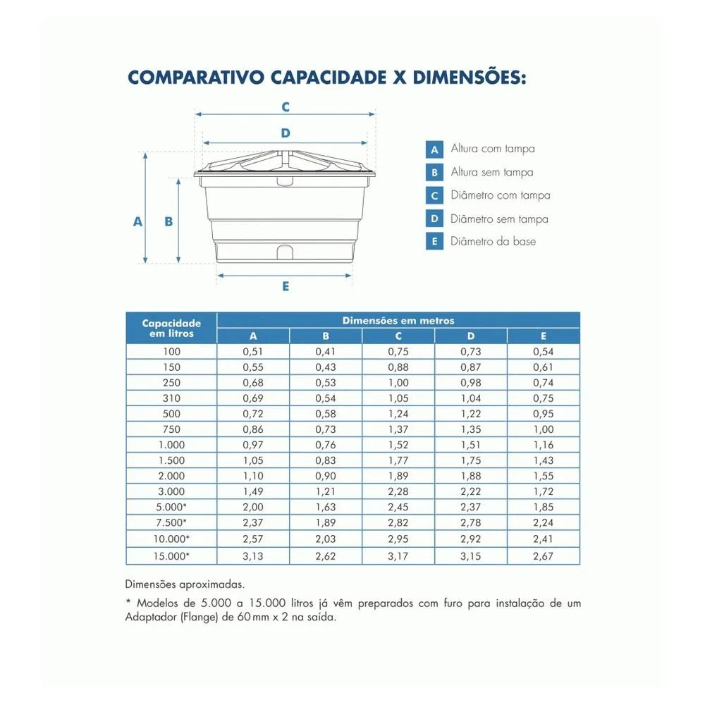

# Monitor de Nível de Caixa d'Água (IoT)

Sistema IoT para monitoramento em tempo real do nível de água em caixas d'água (ou qualquer reservatório), usando ESP32 e sensor ultrassônico. Nesta etapa, as leituras — altura, percentual e volume — são exibidas no Serial Monitor.

> Projeto da disciplina de Internet das Coisas (IoT) — Curso de Sistemas de Informação, IFMA Campus São Luís / Monte Castelo.

## Problema que resolve

O desperdício de água e o desabastecimento doméstico são problemas comuns: muitas vezes o morador não sabe se a caixa está cheia, pela metade ou prestes a esvaziar, o que leva a falta de água inesperada. Este sistema mede o nível continuamente e disponibiliza a informação, eliminando a verificação manual.

## Como funciona

O sensor fica no topo do reservatório, apontando para baixo, e mede a **distância** até a superfície da água (o espaço vazio). O ESP32 então calcula:

1. **Altura da água** = `distância até o fundo − distância medida`
2. **Volume** = a partir da altura, conforme o formato do reservatório
3. **Percentual** = `volume atual / capacidade × 100`

Importante: o sensor não mede o volume diretamente — ele mede distância, e o microcontrolador converte em altura, percentual e volume.

### Tratamento de ruído

Para garantir leituras confiáveis, o sistema:
- **Descarta valores impossíveis** (muito próximos ou além do fundo), que indicam erro de leitura.
- **Tira a média de 15 amostras por ciclo**, suavizando o ruído causado pelo movimento da água dentro do reservatório.

## Modos de cálculo de volume

O sistema suporta três modos, escolhidos pela variável `FORMATO` no código:

| Modo | Precisão | O que preencher | Quando usar |
|------|----------|-----------------|-------------|
| `CILINDRO` | Exato | `RAIO` | Recipiente reto (ex.: garrafa de demonstração) |
| `CONE` | Exato | `RAIO_BASE` e `RAIO_TOPO` | Caixa em formato de tronco de cone, com dimensões conhecidas |
| `CAPACIDADE` | Estimativa | `CAPACIDADE_L` | Caixa qualquer, quando só se conhece a capacidade em litros |

No modo `CAPACIDADE`, o volume é estimado de forma linear (proporcional à altura). Isso é **exato para cilindros**, mas uma **aproximação para cones** — adequada para uso doméstico, sem exigir medição da geometria.

## Como descobrir as dimensões da caixa

Há duas formas de obter as medidas necessárias:

**1. Medindo diretamente.** Com uma trena, meça o diâmetro interno da base, o diâmetro interno no topo (no nível cheio) e a altura útil da água.

**2. Pela tabela do fabricante.** A maioria das caixas tem uma tabela de *capacidade × dimensões*, em que cada capacidade já vem com suas medidas. Assim você não precisa medir nada — basta saber a capacidade e o modelo da caixa.

> Fonte: catálogo do fabricante da caixa. (Substitua pelo nome do fabricante da imagem que você usou.)

Legenda das dimensões da tabela:

- **A** — altura com tampa
- **B** — altura sem tampa
- **C** — diâmetro com tampa
- **D** — diâmetro sem tampa
- **E** — diâmetro da base

Mapeando para os parâmetros do código (a tabela está em metros; o código usa centímetros):

- `RAIO_BASE` = E ÷ 2  (diâmetro da base, dividido por 2)
- `RAIO_TOPO` = D ÷ 2  (diâmetro sem tampa, dividido por 2)
- altura útil ≈ B  (altura sem tampa)

### Exemplo: caixa de 1.000 litros

Pela tabela, a caixa de 1.000 L tem E = 1,16 m, D = 1,51 m e B = 0,76 m. Convertendo para os parâmetros do código (em cm):

- `RAIO_BASE` = 1,16 ÷ 2 × 100 = **58 cm**
- `RAIO_TOPO` = 1,51 ÷ 2 × 100 = **75,5 cm**
- altura útil ≈ 0,76 × 100 = **76 cm**

O volume calculado pela fórmula do tronco de cone com esses valores fica próximo dos 1.000 L nominais. A pequena diferença vem do formato real da caixa (nervuras, base reforçada e a tampa abaulada), que não é um cone geometricamente perfeito — por isso o modo `CONE` é uma boa aproximação, e o modo `CAPACIDADE` (usando direto os litros da tabela) costuma ser suficiente.

## Componentes usados até o momento

- **Microcontrolador:** ESP32 (NodeMCU ESP32), com Wi-Fi integrado
- **Sensor:** ultrassônico HC-SR04 (protótipo de bancada) / JSN-SR04T IP67 previsto para a caixa real
- **Alimentação:** USB 5V

### Ligações (pinos)

| Sinal | Pino ESP32 |
|-------|-----------|
| TRIG  | GPIO 5    |
| ECHO  | GPIO 18   |

> O pino ECHO do HC-SR04 opera em 5V e o GPIO do ESP32 tolera 3,3V — use um divisor de tensão no ECHO (1 kΩ em série + 2 kΩ para o GND). Alternativa: usar o HC-SR04P, que funciona em 3,3V e dispensa o divisor.

## Instalação e calibração

Antes de rodar, é preciso descobrir três valores de referência (calibração feita uma única vez):

1. Fixe o sensor no topo do reservatório, apontando reto para baixo, sobre água aberta (longe da boia, do cano de entrada e das paredes).
2. Com o reservatório **vazio**, observe a distância no Serial Monitor → este valor é o `DIST_FUNDO`.
3. Encha até o nível máximo e observe a distância novamente → este valor é o `DIST_CHEIO`.
4. Obtenha a **capacidade em litros** (rótulo da garrafa ou valor estampado na caixa) → `CAPACIDADE_L`.

A partir daí o sensor apenas lê a distância continuamente, e o código usa esses valores fixos para calcular tudo.

### Cuidados de instalação

- Aponte o sensor perpendicular à água; se ficar inclinado, o eco se perde.
- Respeite a zona cega do sensor: o JSN-SR04T não lê abaixo de ~20–25 cm, então deixe folga de ar mesmo com o reservatório cheio.
- Proteja a eletrônica da umidade e da condensação; apenas a cabeça do JSN-SR04T é à prova d'água.
- Em caixa de água potável, mantenha a placa e os fios fora da água, isolados por cima.

## Como executar

1. Abra `src/monitor_nivel_serial.ino` na Arduino IDE com o suporte a placas ESP32 instalado.
2. Em `FORMATO`, escolha o modo: `CILINDRO`, `CONE` ou `CAPACIDADE`.
3. Preencha os parâmetros de instalação (`DIST_FUNDO`, `DIST_CHEIO`) e os do modo escolhido.
4. Compile e envie para o ESP32.
5. Abra o Serial Monitor a 115200 baud para acompanhar as leituras.

## Status atual — o que já funciona

- [x] Leitura da distância pelo sensor ultrassônico
- [x] Descarte de leituras inválidas
- [x] Média de 15 amostras por ciclo para reduzir ruído
- [x] Cálculo de altura, percentual e volume
- [x] Três modos de cálculo de volume (cilindro, cone, capacidade)
- [x] Exibição das leituras no Serial Monitor

## O que ainda falta implementar

- [ ] Dashboard para visualização remota (Blynk / Home Assistant)
- [ ] Alertas de nível crítico (abaixo de 20% e caixa cheia) por e-mail ou Telegram
- [ ] Migração da comunicação para MQTT (conforme proposta)
- [ ] Registro de histórico de leituras para análise de consumo

## Autor

Felipe Moura de Oliveira
